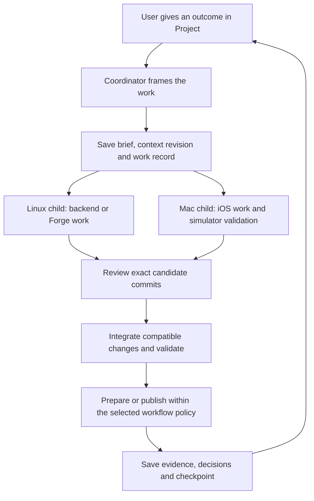

> **Implementation update (2026-09-11):** [IMPLEMENTATION.md](IMPLEMENTATION.md) is the current contract. A project is a Git meta-repository with multiple coordinator sessions, coordinated through a Forge CLI skill. Ting is not required. The original design below is retained as a design snapshot.

# Project vision and operating experience

**Status:** proposed behavior for discussion. No feature in this document has been implemented by this design branch.

## Mission

Let a person direct a substantial body of work through one continuing conversation, while a project agent organizes execution, context, review, and delivery across the mesh. The user should be able to return after a day, a host restart, or a conversation compaction and continue from an accurate account of the work.

The unit of organization is the user's mission. A repository, machine, coding harness, deployment, or individual conversation is a resource used to advance that mission.

## What a project contains

| Element | Meaning |
| --- | --- |
| Identity | Stable project ID and display name, independent of a coordinator session's lifetime. |
| Mission | Purpose, desired outcomes, vision, scope, constraints, and measures of success. |
| Coordinator | One current Forge conversation, with a project role, on a selected owner environment. |
| Knowledge | Brief, decisions, wiki, current checkpoint, timeline, and references to source data. |
| Repositories | One or more repositories, their purpose, branches, setup and validation contracts. |
| Environments | Preferred hosts, allowed alternatives, toolchains, data access, and deployment targets. |
| Work | Features, investigations, fixes, reviews, and releases, each with an objective and evidence. |
| Sessions | Coordinator and child Forge sessions, with explicit membership, lineage, and lifecycle. |
| Workflows | Versioned recipes for how to explore, build, review, integrate, and publish. |

A feature need not become a separate project or a separate coordinating session. Start with a work record and one or more child sessions. Introduce a feature coordinator only when the task's size justifies it. Future nested projects can reuse a group relationship without forcing that hierarchy into the first UI.

## Examples

**Lexi:** a Linux service change, Forge integration change, iOS UI, and bridge update can be one feature. The coordinator keeps compatibility and deployment ordering visible across those repositories. A release can identify a set of source commits and artifacts rather than pretending there is one universal Git commit.

**Lexi Physics/Lia:** a distinct mission with its own experiments, terminology, simulation evidence, application work, and memory namespace. It may use the same machines without inheriting Lexi's task history.

**Work:** a project can use a different set of authorized repositories and hosts. Shared infrastructure does not imply shared project data. A work project's context must not leak into a personal project's worker prompt or wiki search.

## Establishing a project

1. In Project, choose **New Project**, enter a name and initial goal, and select an owner environment and coordinator harness/model/effort. Offer existing defaults and capability-aware alternatives.
2. Create a project group and its coordinator session. The coordinator's working directory is the coordination repository. Starting with no application repository is valid.
3. Discuss the mission conversationally. The coordinator drafts the brief, captures constraints, and asks only for unresolved choices that affect the work.
4. Add repositories, data references, allowed environments, and a first workflow. Resolve logical repository names to paths on each selected host; do not assume Thor paths exist on Spark or the Mac.
5. Present the resulting brief for review. Record accepted choices and unresolved questions. Project setup can remain a draft while that conversation continues.
6. Begin the first work item. Store the context revision and selected workflow before dispatching children.

An existing Forge conversation can also become a project's first coordinator. Adoption adds membership and a project workspace/context binding without replacing its transcript. An existing worker session can be attached after its purpose, permissions, and repository fit are checked. Neither operation should silently adopt every old session in that repository.

## From a request to delivered work

Example request: “Make voice startup faster, get an independent review, and prepare a build I can test.”

The coordinator turns that into a brief: measurable startup behavior, affected components, known audio-routing constraints, a validation plan, and a delivery target. It creates a work record linked to the original request, then selects a suitable workflow.



This is a conceptual sequence, not a requirement to launch all children at once. Repository dependencies, conflicting edits, host capacity, and the requested level of review determine the actual execution order.

Each child receives a **bounded assignment**: what to achieve, why, what it owns, what it may change, which context revision applies, and what result to return. A child may use native subagents internally. A separately addressable job on another host or harness becomes a child Forge session.

Completion means a verified outcome and a recorded handoff. “The process stopped,” “the model said done,” “a tool returned,” “the branch merged,” and “the deployment is healthy” describe different events. The coordinator reports the appropriate one.

## Workflow catalog

| Workflow | Typical steps | Required result |
| --- | --- | --- |
| Explore | Frame question → inspect independently where useful → synthesize. | Findings with sources, uncertainty, and recommended next action. |
| Build and prepare | Implement → targeted tests → summarize changes → prepare artifacts. | Reviewable diff and evidence; publishing only if included in the work's authorization. |
| Build and adversarial review | Implement → separate reviewer → resolve findings → retest changed candidate. | Findings disposition and validation tied to the final commit. |
| Cross-repository feature | Contract → dependent changes → compatibility checks → ordered integration. | A compatible set of repository revisions and rollout instructions. |
| Publish | Verify accepted candidate → build on required host → publish → check target. | Artifact identity, source revisions, target, health result, and rollback reference. |

These are small versioned recipes initially. Ting is the existing candidate for executing their staged form; its fit for the native Forge pilot must be demonstrated. A project can choose lightweight execution for routine changes and deeper review for consequential work without creating a new project.

## The coordinator's operating contract

The project role should explicitly instruct the agent to:

- Keep the user's objective, accepted decisions, current work, and unresolved questions accurate.
- Turn sufficiently clear requests into bounded assignments and act within the recorded authorization.
- Delegate implementation, long-running commands, and independent reviews to the appropriate Forge sessions; avoid occupying the coordinator with lengthy execution.
- Include repository rules, known environment constraints, acceptance criteria, context revision, and reporting requirements in every assignment.
- Use a small useful number of workers. Respect project concurrency limits and host capacity; expanding the tree is not itself progress.
- Inspect child evidence, reconcile contradictory findings, and distinguish observed facts from hypotheses.
- Notice stalled work through durable status/result notifications and decide whether to clarify, retry, replace, or stop it.
- Record decisions and discoveries when they occur. Update the checkpoint after accepted plans, dispatches, material results, and handoffs.
- Surface blockers precisely. A stopped host or expired model login must not look like successful completion.
- Keep replies useful for project direction: outcome, current work, needed decisions, and evidence links.

The coordinator is an agent, not the durable scheduler. A service must still observe child completions while the model is idle. A prompt cannot guarantee uninterrupted responsiveness during a long model turn; the UI needs honest queued/delivered states and the runtime needs a defined way to resume work.

## Context repository

Illustrative structure, to be created only during implementation or project onboarding:

```text
lexi-project/
  project.yaml                 # identity and declared configuration
  PROJECT.md                   # mission, vision, scope, success criteria
  AGENTS.md                    # coordinator guidance for Codex
  CLAUDE.md                    # equivalent coordinator guidance for Claude
  context/
    CURRENT.md                 # bounded resume checkpoint
    REPOSITORIES.md             # purpose, setup, branches, instructions
    ENVIRONMENTS.md             # logical hosts, capabilities, allowed targets
  workflows/
    build-and-review.yaml
    prepare-ios-build.yaml
  decisions/
    0001-project-ownership.md
  wiki/
    architecture.md
    testing.md
  work/
    voice-startup/
      BRIEF.md
      HANDOFF.md
  timeline/
    2026-09.md
  evidence/
    index.md                   # links and checksums, not large raw transcripts
```

The root guidance files belong to the coordination repository. They should share a canonical role template so that Codex and Claude receive consistent expectations. Do not overwrite application repositories' existing `AGENTS.md` or `CLAUDE.md` during session creation. Forge already deliberately avoids that destructive injection behavior.

`CURRENT.md` contains current objectives, recent accepted decisions, active work and session references, pending questions, known failures, last acknowledged result positions, and next actions. It includes a checkpoint time and revision. It is an aid to recovery, not an authoritative report that an old child is still running.

A worker starts from a pinned context bundle: project brief summary, relevant decisions, task brief, relevant workflow version, repository rules, and pointers to larger material. A provisional target is at most 8 KiB of automatically injected project context, measured and adjusted in the pilot. Larger wiki pages are fetched when relevant. The budget must never silently remove a critical constraint; assembly fails visibly or requests a shorter brief instead.

## Memory and synchronization

The project owner service maintains the canonical context checkout and serializes its updates. Children submit findings or proposed patches under distinct work IDs. They do not all write the same `CURRENT.md` or concurrently push the same context branch.

Useful decisions become dated, attributed records with links to their source session, relevant evidence, and superseded decisions. Accepted records enter the curated wiki and GBrain project namespace. Machine-generated hypotheses remain marked as hypotheses until reviewed against evidence.

The present GBrain integration has a single local service connection. Reuse that ownership model and add scoped access; do not put its live database on a shared network folder or start one writer per child. For an offline or isolated host, distribute a pinned document bundle and queue findings for later ingestion. Knowledge retrieval failure should not prevent work that has its required context already.

Git synchronization records separate states: saved locally, committed, backed up remotely. GitHub being unavailable cannot be reported as a successful backup. Database backups and artifact retention remain necessary: a Git copy of the brief cannot restore all conversation events or an uncommitted application worktree.

## iOS interface

The proposed primary order is **Channels · Voice · Project · Code · Settings**. Loops is retired and is not needed, as confirmed by the user during this discussion; there is no relocation or revival of that feature in this plan. The iPad sidebar/tab ordering receives Project as well; a Mac UI redesign is not part of the initial pilot.

**Project list:** show one row per non-archived project, backed by its current coordinating Forge session. Each row contains a title, short mission/current-work summary, coordinator host and model, active-child count, and attention state. A stale/offline badge is separate from lifecycle. Archived projects are available through an explicit filter. A stopped coordinator does not make its project disappear.

**Project conversation:** reuse the existing Forge transcript and composer. Add a compact project header with Work, Brief, and Knowledge actions. Open the conversation first; do not require the user to navigate a dashboard before giving direction. A short activity summary links to child sessions; it does not splice every child's full transcript into the coordinator conversation.

**Work view:** show active and attention-needed children first, with stopped and archived history available. A work item groups its implementer/reviewer/validator sessions. Tapping a session opens Code with the project filter and a clear breadcrumb back to the project. The parent's conversation scroll position and draft are preserved.

**Code:** add Project grouping and a project filter. Display names come from group metadata, not repository-name guesses. Unassigned sessions have an explicit Unassigned section. Project coordinators appear primarily in Project; an explicit all-sessions view may include them. Existing host/repository/status organization remains available.

**Continuity:** Project and Code must share the same session-model/cache ownership, so opening the coordinator or a child through another tab does not create duplicate sockets or lose a draft. Fetch recent transcript pages; retrieve older history on demand. Switching projects should not load all descendants' logs.

**Actions:** distinguish Stop session, Resume session, Archive session, Pause project dispatch, and Archive project. Pause prevents new launches while reporting ongoing children. An explicit stop-all operation tracks acknowledgments per host. Archiving never implies killing unknown work or deleting its repository.

**Later voice:** route a project voice interaction to the same project ID and current coordinator, with durable request IDs and the same authorization context. It should not create an unrelated coordinator or introduce a second project memory. Voice is deliberately deferred until the text workflow is proven.

## Boundaries for the first version

The first version includes project onboarding, one coordinator, child creation and adoption, cross-host identity, shared context, reliable result return, recent replay, grouping, and recovery. It does not require thousands of workers, automatic owner failover, a generic visual graph editor, external subscription automation, nested-project UI, or a new browser session renderer.

Growth should follow demonstrated need: one complete Lexi workflow first, then additional workflows, more models and hosts, project-specific voice, and eventually nested coordination or subscriptions.
