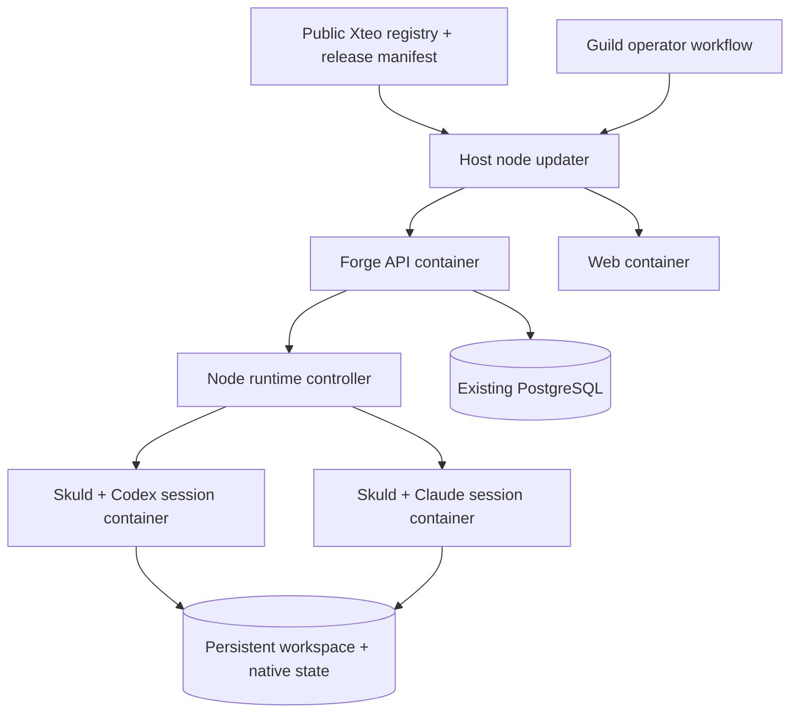

# Forge fleet releases from containers

Status: proposed design, 2026-09-22. No container publication or migration is
performed by this document. It extends the
[MCP, skills and notification design](mcp-skills-notifications-design.md).

## Recommendation

Build once in CI, publish public multi-architecture OCI images under `ghcr.io/xteo`,
and promote an immutable release manifest across the Guild one node at a time.
Nodes need a small installation/configuration bundle;
they should not need a Git checkout, Node build toolchain or Python dependency
resolution to upgrade Forge.

Separate three lifecycles: the Forge API, each Skuld/native session, and the node's
container engine/database. Replacing an API container must never replace session
containers or restart the engine/database. Updating the Skuld default affects new
starts; existing sessions retain their exact image until an explicit safe refresh.

For this small Linux fleet, use the existing Docker capability and a minimal
Compose/systemd installation with an independent node updater. Do not require a
Kubernetes migration to obtain reproducible releases. Keep the existing Kubernetes
adapters for deployments that already use them.

## What the repository already provides

| Existing component | Useful capability / gap |
| --- | --- |
| `containers/niuu/Dockerfile` | Frozen Python package installation, amd64/arm64 support and non-root user. Its default command serves shared services, not the full Guild/Forge composition used on these hosts. The Volundr chart overrides the command for the standalone Volundr API. |
| `containers/skuld/Dockerfile` | Packaged Skuld, tmux, Claude and Codex. Native tools use npm lockfiles; the current Codex image pin is `0.144.1`, while the repository also contains a `0.154.0` alignment review. The intended native CLI must be explicitly qualified, not inferred from the host or updated at container startup. |
| `containers/niuu-web`, `containers/volundr-web` | Existing static web image builds; retain the chosen UI and its external runtime configuration. |
| `reusable-container-build.yaml`, `dev.yaml`, `feature.yaml`, `release.yaml` | Existing GHCR build/push and amd64/arm64 manifest assembly. The dev workflow triggers on `dev`, the feature publisher on `feat/**`; neither automatically publishes `forge/ux-improvement`. Stable releases additionally sign images and scan them. |
| `LocalProcessPodManager` | Launches Skuld as a local child using the selected interpreter; reconstructs routes from local state. It is not an independently managed Docker session backend. |
| `DirectK8sPodManager`, Flux and OpenShell adapters | Existing independently managed runtime patterns and PodManager port. Reuse their lifecycle contracts rather than adding Docker conditionals to domain services. |
| `LocalContainerResidentRuntimeController` | Docker SDK, labels, mounted state and discovery patterns. Its supported resident profiles are Ravn/OpenClaw/Hermes; it is not a drop-in Codex/Claude session adapter. Its replacement semantics also require separate review before reuse for live sessions. |
| Runtime-version endpoint / web badge | Compares loaded broker identity against available local-process source. Container backends need an explicit available image/manifest identity rather than guessing from the API's own source. |

The current build identity functions assume a source checkout in places. A
non-editable wheel does not retain that directory layout: scanning `root/src` can
produce an empty-tree digest. `NIUU_BUILD_SHA` and `NIUU_BUILD_REVISION` are also
separate contracts today, and the Dockerfiles do not bake the complete identity.
Package a single immutable build manifest and test both `/health` and version
endpoints in the actual image, without `.git` or a source bind mount.

The source repository and the selected GHCR packages are public. Package visibility
is independent of repository visibility; verify anonymous pulls for each release.
Runtime credentials, host identity, databases and workspace data remain external
to images. Registry publishing remains authenticated through CI.

## Node layout and ownership

The node updater is outside the replaceable API container and can finish an
operation or restore the previous image while the API is unavailable. Its small
installed executable is independently versioned. A local runtime controller may
share that daemon, but release and session operations remain separate interfaces
with separate grants. The API uses an authenticated Unix socket or restricted
node channel. Coding session containers do not receive the Docker socket or
registry publishing credentials. Docker daemon access is a privileged host
capability; see the [Docker security model](https://docs.docker.com/engine/security/).

One session container owns its Skuld and native CLI process. Persist its Forge ID,
native thread/session ID, workspace mount, CLI home/state, event journal and pending
delivery disposition outside the writable container layer. Preserve original host
path mappings and UID/GID permissions; a path used by the Docker daemon is a host
path, not the API container's filesystem path. Do not embed provider credentials,
node identity, database data or workspaces in an image.

Every container is labelled with canonical owning node ID, session ID, runtime
kind and selected image digest. Reconciliation after API restart adopts existing
containers by validated identity and rebuilds proxy routes. Missing/unreachable
containers are reported explicitly; discovery must not silently create a second
native owner or resend an initial prompt. Controller shutdown closes clients only;
session stop/delete is a distinct explicit operation.

Keep the node's Tailscale identity and public URL stable. Route browser HTTP/WS
through the existing front proxy. Broker callbacks use a stable reachable endpoint
on the node network; `localhost` inside a container cannot mean the host's Forge.
Keep PostgreSQL separately managed during the initial migration. Database engine
upgrades remain their own maintenance operation.

## Build and promote

Reuse the existing reusable build workflow. Add an explicit milestone publisher
for a selected commit, initially the reviewed Forge integration branch. Publish
tested artifacts first, then atomically promote a release manifest only after all
required build, test and scan jobs pass. Existing workflows can publish images
while tests are running; an image tag alone is therefore not a release approval.

Use proposed image names such as `ghcr.io/xteo/niuu`, `ghcr.io/xteo/skuld`, and
`ghcr.io/xteo/niuu-web`; reuse verified existing packages where available. A common
Skuld image is enough initially, with distinct Claude/Codex launch profiles.
Special project toolchains can derive versioned runtime images later. Nodes pull
the same promoted artifact rather than rebuilding it.

The manifest contains release ID, full source commit, API/web/Skuld image digests,
platform manifests, tested native CLI versions, database migration compatibility,
broker protocol range, MCP/skill bundle versions and minimum updater version.
Use readable tags for discovery (`forge-dev`, milestone version, commit tag), but
install by digest and retain the last known-good manifest. Labels/build metadata
and signed release attestations must identify the same source.

Build Linux amd64 and arm64 on the existing native CI runners. A manifest list
selects the appropriate platform when pulled; it is not one architecture-neutral
binary. See [Docker multi-platform builds](https://docs.docker.com/build/building/multi-platform/).
Keep runtime CLI versions pinned and exercise actual Codex/Claude launch, resume,
tools, approvals, image transport and replay against each supported platform.

CI publishes through its repository-scoped GitHub token. Public images need no
pull credentials on nodes. Never put runtime or publishing credentials in release
manifests, chat, skill text or image layers. Verify digest pulls anonymously; see
[GitHub's container registry documentation](https://docs.github.com/en/packages/working-with-a-github-packages-registry/working-with-the-container-registry).

## Deployment operation

Expose a durable administrative operation, not an arbitrary shell command sent to
an LLM. Proposed steps: `queued -> prefetching -> preflight -> applying -> verifying
-> succeeded`, with `blocked`, `failed` and `rolled_back` results. An operation has
an idempotency key, exact target manifest, node identity, lease/fencing token,
timestamps, previous selection and append-only evidence. One deployment owner per
node; retry queries the existing operation rather than restarting it blindly.

The node updater can poll authenticated desired state over the mesh, avoiding an
SSH requirement. Guild presents current/desired versions, download readiness,
compatibility blockers and maintenance controls. The proposed Forge MCP can later
request an operator-authorized deployment through this same contract; ordinary
session capabilities do not grant fleet administration.

1. Prefetch and verify all target images while the current API and sessions run.
2. Check node/config identity, disk space, runtime compatibility, independent
   session owners and readiness of the rollback image. Briefly gate new lifecycle
   mutations; existing agent turns continue.
3. Back up affected data and apply compatible additive migrations through one
   exclusive migration owner. Record checksums. Do not run two active API
   reconcilers against the same node merely to obtain a blue/green health check.
4. Replace only the API service and, independently when required, static web.
   Reconnect to existing session containers and verify health, owner routes,
   retained conversation content and runtime identities. Reopen lifecycle writes.
5. If checks fail, restore the previous compatible API image. Reverting an image
   does not reverse a database migration; destructive schema changes need a
   separate maintenance plan and cannot advertise automatic rollback.
6. Promote the next node only after acceptance. Keep offline nodes pending with
   visible reasons; never block healthy inventory behind them.

For a qualified Compose installation, `up --no-deps` can target the selected API
service, and `--wait` waits for health. Compose recreates changed-image containers
while retaining mounted volumes; this is why sessions must be separate services
outside the API replacement set. See [Compose up](https://docs.docker.com/reference/cli/docker/compose/up/).
The deployment operation must not use whole-stack `down`, orphan removal, volume
deletion or engine restart. Docker
[live restore](https://docs.docker.com/engine/daemon/live-restore/) concerns daemon
outages; it does not turn replacement of a session container into a live upgrade.

Preservation checks compare IDs, order and retained content, plus raw journal
prefixes. A deliberately changed presentation must have an explicit bounded
expectation. For example, the September 22 BuildBro candidate omitted ten typed
history-delivery errors while all 260 retained turns matched. Verify raw kind/code
and deterministic IDs before accepting that difference; prose matching or broadly
ignoring errors is not adequate. Keep the original failed attempt and rollback
evidence even after the corrected release succeeds.

## Updating Codex / Skuld sessions

| Session condition | Upgrade behavior |
| --- | --- |
| New session | Starts on the node's approved Skuld image digest. |
| Stopped session | Next explicit start selects the approved compatible image and resumes saved native state. No launch solely to refresh a version. |
| Live and working | Retains its current image. Show update availability and any compatibility requirement. |
| Live and idle | Retains its image until a user requests refresh and fresh checks prove a safe boundary. Idle alone is insufficient. |
| Awaiting input, approval or unresolved delivery | Refresh blocked with the specific reason. |

An explicit refresh must lock the session, check a committed journal checkpoint,
native inactivity and empty control/delivery queues, save native identity, replace
only that session container, and verify resume without replaying a prompt. A new
message arriving before the boundary cancels the refresh. Report ambiguous native
resume failures without guessing whether another send is safe.

Expose loaded and available API, Skuld and native CLI versions independently. A
new API does not imply a new Codex process. Compatibility is an explicit protocol
range/capability set, not ordering two Git SHAs. Container digests identify exact
artifacts; a tested manifest states which combinations are supported. Eventually
offer opt-in `refresh at next safe boundary`; default to manual until checkpoint
and recovery behavior is proved for each harness.

Existing host-native sessions cannot be moved into a container in place. The
transition needs a host runtime bridge for those existing owners, or a later
owner-approved stop/resume migration. Keep legacy and new container backends
coexisting per session; do not ask a containerized local-process adapter to infer
host PID ownership through a shared PID namespace.

## Deliverable sequence

1. Package a complete Forge API composition with external databases, version
   manifest, packaged migrations and the selected UI. Add public milestone CI
   publication, platform smoke checks and the release manifest. No fleet switch.
2. Implement the Docker session adapter behind the existing PodManager port,
   persistent state, authenticated host runtime/updater bridge and one-node
   installation bundle. Qualify API replacement with real running sessions and
   output during the API outage. Test restart discovery and no duplicate send.
3. Add Guild version/deployment operations and rollback evidence. Pilot a spare
   node, then promote one at a time. Preserve legacy host runtimes until migrated.
4. Add guarded per-session refresh for Codex, then Claude. Carry project skill and
   MCP manifests with the selected runtime; new notification events can report
   release milestones and blocked maintenance through the shared feed.

Acceptance: a fresh node installs from artifacts without cloning source; an API
update leaves live native session identities unchanged; stopped sessions use the
selected runtime next start; a failed API candidate recovers without data loss or
prompt duplication; native refresh preserves Forge/native IDs and conversation;
and web/iOS accurately distinguish API deployment from runtime adoption.
